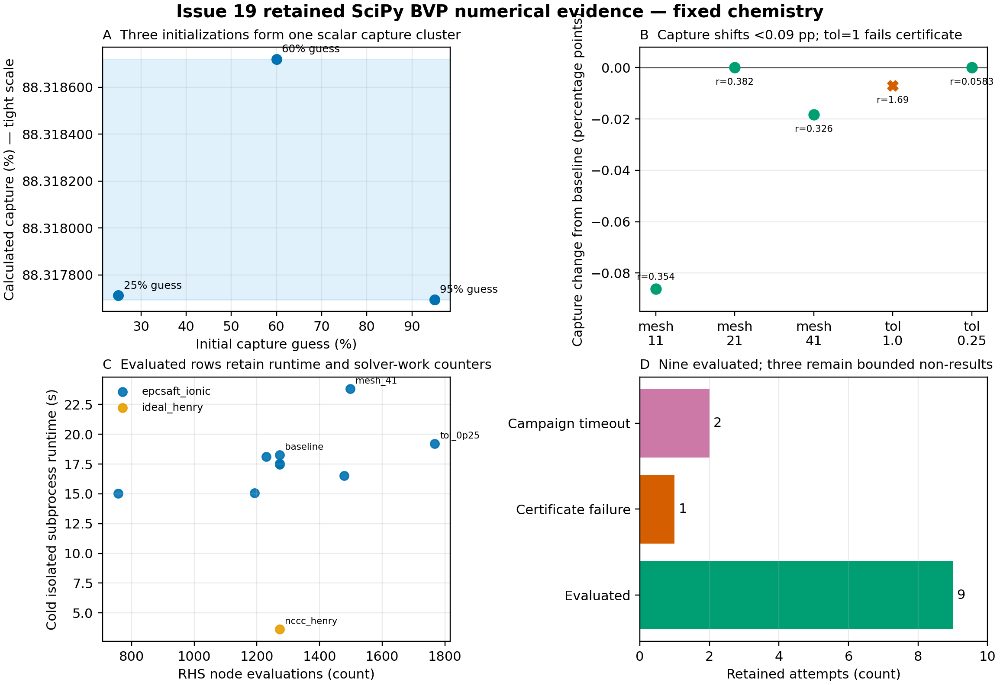

# Decision addressed

This notebook summarizes the independently reviewed, retained Issue 19
fixed-chemistry SciPy boundary-value-problem (BVP) rows. It asks whether the
existing direct SciPy route supplies bounded numerical evidence for NCCC 2017
Case 3C and what the attempted SRP-LG7 rows establish. Rendering reads no live
model state and runs no column, thermodynamic, chemistry, or reactive-film
calculation.

The answer is deliberately limited. Nine of twelve attempts meet the retained
solver, independent residual, conservation, and basic state checks. One
solver-success row fails the independent residual certificate, and two SRP-LG7
attempts reach the 100 s campaign watchdog. These rows support a bounded
fixed-chemistry numerical verification record. They do not establish true
solution-profile or branch agreement, broad physical validation, completion of
the 21-state reactive-film campaign, or final numerical-method selection.

# Retained evidence and admission

The notebook uses only:

- `results/final/tables/issue19_scipy_bvp_candidate_rows.csv`, SHA-256
  \nolinkurl{559472867bfbad275ad57615b02de68a76908b155a9fcbb8a1b2b95072d91585};
- `results/final/tables/issue19_scipy_bvp_summary.json`, SHA-256
  \nolinkurl{607fa15b499b021840a92c696ecce8764ca0529ec767791455d384324878ac56}.

An independent CSE Review passed these retained files at pull-request head
\nolinkurl{30a1d678604e09f10784c9194f7ce92fed54e1e3}. The candidate table contains
12 declared attempts and one row per immutable run identifier. The summary
records 9 validated rows, 1 certificate failure, and 2 campaign timeouts.

## Exact calculation identity

- Repository calculation commit:
  \nolinkurl{2c05d6238d4498b2cf698421aebd14692b2962f8}
- Repository base commit:
  \nolinkurl{771f4ffd9f4780d1de607ae94651a0ae83787770}
- Generator SHA-256:
  \nolinkurl{4e9cbda018add96f6cb57d7f6e258a32cfd1c701ee76c44fdfc760e22ebdd0f1}
- ePC-SAFT Engine commit and version:
  \nolinkurl{41e7dc1984d00f82785900b314a0135beebe56cd}, `0.2.0.dev0`
- Wheel and SHA-256:
  `epcsaft-0.2.0.dev0-cp313-cp313-linux_x86_64.whl`,
  \nolinkurl{2d089d5bdeda5b1655c5e6cf5df7308507233381175745889f8430c22ffe1edb}
- Engine core SHA-256:
  \nolinkurl{fc1f1a78b2fe5c68a54b8678ce6bc844a2eba11edec91d49e6f9a51c62e1132f}
- Dataset and content SHA-256:
  `MEA_CO2_H2O_ionic_fit`,
  \nolinkurl{f7ad460743352cfc4e6683bee4f7718d1628f94bf80fc6e9c15f2d0e14675b1c}
- Parameter-document SHA-256:
  \nolinkurl{1d03e802c493f063e97e9b15fa5107b50fe69fa4cca2da9dd478554768ec1998}

The retained run command fixes the per-case watchdog explicitly:

```text
OPENBLAS_NUM_THREADS=1 OMP_NUM_THREADS=1 MKL_NUM_THREADS=1 \
  uv run python \
  analyses/bvp_derivative_trials/scripts/run_issue19_column_verification.py \
  --case-timeout-s 100
```

# Quantities and checks

Capture is reported in percent, and capture differences are percentage points
(pp). Runtime is cold isolated subprocess wall time in seconds. Mesh points,
final nodes, iterations, function calls, and node evaluations are counts. The
configured `tol`, `bc_tol`, dense ODE residual, and dense boundary residual are
dimensionless quantities in the solver-scaled state.

The numerical certificate requires the maximum independent dense-grid ODE
residual not to exceed `tol`, the dense boundary residual not to exceed
`bc_tol`, the reported boundary residual not to exceed 1, and both retained
component-conservation relative residuals not to exceed $10^{-8}$. The narrow
basic state check requires capture between 0% and 100%, zero invalid-state
count, and zero guard-penalty count. Passing that check is not a physical-model
validation claim.

# Results

{#fig-summary width=100%}

## Initialization capture clusters

| Initial capture guess (%) | Calculated capture (%) | Change from baseline (pp) | Scalar cluster | Runtime (s) |
|---:|---:|---:|:---|---:|
| 25 | 88.317713 | +0.000018 | `capture_cluster_1` | 16.534 |
| 60 | 88.318720 | +0.001025 | `capture_cluster_1` | 18.135 |
| 95 | 88.317696 | 0.000000 | `capture_cluster_1` | 18.253 |

The three validated initializations span 0.001025 pp and meet the retained
0.5 pp scalar clustering rule. The rule compares only outlet capture within a
case and thermodynamic model. No state profiles were retained, so the evidence
does not establish numerical solution-profile identity or a common solution
branch.

## Mesh and tolerance behavior

| Setting | Initial mesh | `tol` | Capture (%) | Change (pp) | Dense ODE residual | Certificate |
|:---|---:|---:|---:|---:|---:|:---:|
| mesh 11 | 11 | 0.50 | 88.231441 | -0.086254 | 0.353674 | pass |
| baseline | 21 | 0.50 | 88.317696 | 0.000000 | 0.381973 | pass |
| mesh 41 | 41 | 0.50 | 88.299413 | -0.018282 | 0.326264 | pass |
| tolerance 1.0 | 21 | 1.00 | 88.310671 | -0.007024 | 1.694749 | fail |
| tolerance 0.25 | 21 | 0.25 | 88.317683 | -0.000013 | 0.058329 | pass |

The three initial meshes produce captures from 88.231441% to 88.317696%, a
span of 0.086254 pp. The `tol=1.0` row is retained as
`certificate_failure/boundary_at_state`: SciPy reported success, but the
independent dense-grid ODE residual of 1.694749 exceeds the configured tolerance
of 1.0. This label rejects the row as validated numerical evidence; it does not
identify a physical failure. The tighter `tol=0.25` row passes with residual
0.058329. Boundary tolerances of $10^{-2}$ and $10^{-4}$ both reproduce the
baseline capture with zero retained dense boundary residual.

## Runtime and evaluation counters

| Retained row | Runtime (s) | RHS calls | RHS node evaluations | Boundary calls | Iterations | Final nodes |
|:---|---:|---:|---:|---:|---:|---:|
| ePC-SAFT baseline | 18.253 | 61 | 1273 | 43 | 2 | 22 |
| ePC-SAFT mesh 41 | 23.805 | 37 | 1498 | 25 | 1 | 41 |
| ePC-SAFT `tol=0.25` | 19.196 | 83 | 1767 | 60 | 3 | 23 |
| ideal-Henry Case 3C | 3.613 | 61 | 1273 | 43 | 2 | 22 |

The timing values are single cold isolated subprocess observations, not a
warm/cold performance distribution. The identical solver counters for the
ePC-SAFT baseline and ideal-Henry row accompany markedly different wall times,
so the counters are retained as work accounting rather than used as a hardware-
independent runtime model.

## Typed non-result outcomes

| Row | Retained outcome | Stopped by | Claim strength | Diagnostic |
|:---|:---|:---|:---|:---|
| Case 3C `tol=1.0` | `certificate_failure` | `certificate_check` | `boundary_at_state` | Dense ODE residual exceeds `tol` |
| SRP-LG7 ideal Henry | `campaign_timeout` | `campaign_watchdog` | `not_established` | 100 s subprocess watchdog |
| SRP-LG7 ePC-SAFT | `campaign_timeout` | `campaign_watchdog` | `not_established` | 100 s subprocess watchdog |

The two SRP-LG7 rows establish only that the declared attempts reached the
100 s execution boundary. They do not establish solver convergence or failure,
a boundary state, capture, or physical invalidity. The failure taxonomy also
reserves `numerical_convergence_failure/boundary_at_state` for explicit known
SciPy `solve_bvp` failure statuses or messages. Any other unsuccessful worker
row is conservatively `subprocess_failure/not_established`.

# Claim boundary and remaining gates

This admitted tranche supports fixed-chemistry numerical evidence for the
existing direct SciPy route. It does not select a final numerical method.
Issue 19 remains open. Its remaining gates include repeated warm/cold runtime
and memory evidence, complete continuation-step and state accounting, and any
required staged or intercooled retention proof.

The Issue 16 scientific prerequisites also remain outside this tranche:
zero-driving-force and desorption behavior, activity-consistent chemistry, and
the blocked 21-state physical reactive-film campaign. No reactive-film result
was attempted or summarized here. Those gates must be satisfied through their
own retained evidence before any predictive or broad physical conclusion.

# Reproduction boundary

Regenerating the figure reads the admitted CSV only:

```text
uv run python analyses/bvp_derivative_trials/scripts/render_issue19_summary.py
```

Rendering this notebook uses the analysis wrapper and disables execution:

```text
bash analyses/bvp_derivative_trials/render.sh
```

Neither command invokes the scientific model. Regenerating the model evidence
is a separate governed action identified by the retained command and immutable
calculation identity above.
