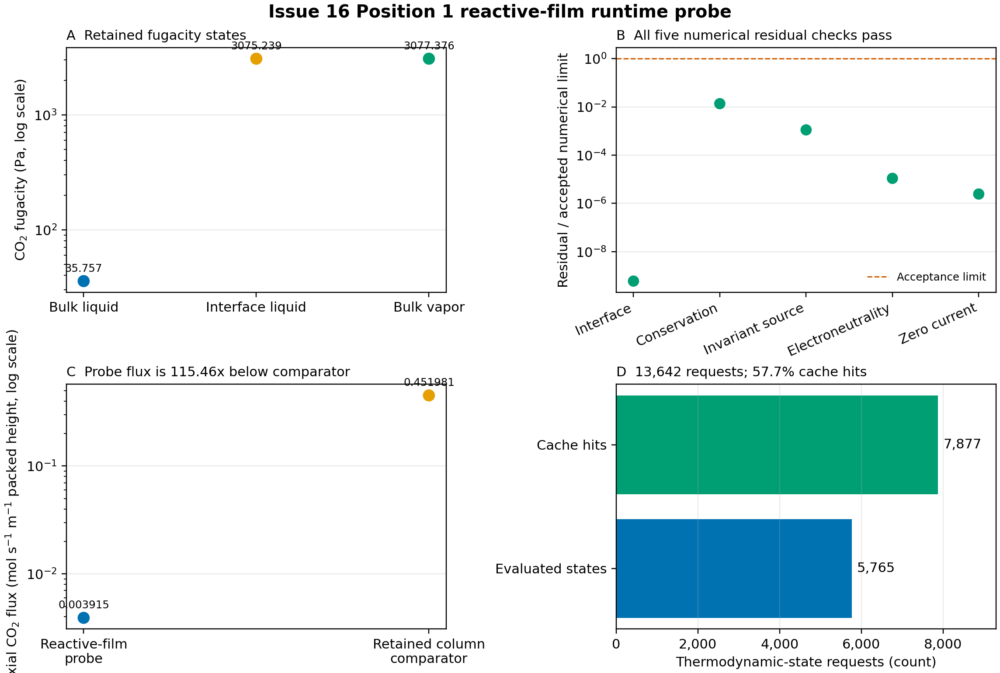

# Question

Does the derivative-enabled reactive-film formulation reach a converged numerical solution at retained NCCC Position 1, and are its values ready for manuscript-level physical claims?

# Retained calculation

| Quantity | Retained value |
|:---|:---|
| Position | 1 |
| Temperature | 318.150 K |
| Pressure | 109,500 Pa |
| CO2 loading | 0.249996 mol CO2 mol-1 MEA |
| Analytical MEA concentration | 4.889310 mol L-1 |
| Initial mesh | 21 points |
| Solver result | Converged to desired accuracy |
| Solver iterations | 6 |
| Final mesh | 355 points |
| Wall time | 592.179 s |
| ODE Jacobian | Exact ePC-SAFT activity chain rule |
| Scientific admission | No |

The calculation used the `MEA_CO2_H2O_retained_predictive` method-development dataset and retained Position 1 speciation. It did not use an accepted predictive parameter packet. The finite-rate coefficients and diffusivities are provisional because the available source candidates failed the scientific-admission checks listed below.

# Numerical results

| Quantity | Value |
|:---|---:|
| Bulk liquid CO2 fugacity | 35.757415 Pa |
| Interface liquid CO2 fugacity | 3,075.239074 Pa |
| Bulk vapor CO2 fugacity | 3,077.376293 Pa |
| Vapor-to-interface fugacity gap | 2.137220 Pa |
| Interface CO2 flux | 5.312554e-5 mol m-2 s-1 |
| Predicted axial CO2 flux | 0.003914766 mol s-1 m-1 packed height |
| Retained column flux comparator | 0.451980846 mol s-1 m-1 packed height |
| Comparator / probe flux | 115.4554 |
| Probe flux as fraction of comparator | 0.8661% |
| Interface / bulk liquid fugacity | 86.0028 |

The interface liquid and bulk vapor fugacities differ by 0.06945% of the bulk vapor fugacity. This small interfacial driving force accompanies a large liquid-film fugacity rise from the bulk state. The retained column value is a diagnostic comparator from a different formulation, not an independent measurement and not a thermodynamic-parameter fitting target.

{#fig-runtime width=100%}

## Numerical residual certificate

| Check | Maximum residual | Accepted limit | Residual / limit |
|:---|---:|---:|---:|
| Interface closure | 5.960091e-17 | 1.0e-7 | 5.960091e-10 |
| Conservation | 1.364461e-9 | 1.0e-7 | 1.364461e-2 |
| Invariant source | 1.114721e-15 | 1.0e-12 | 1.114721e-3 |
| Electroneutrality | 1.087048e-17 | 1.0e-12 | 1.087048e-5 |
| Zero current | 2.435875e-18 | 1.0e-12 | 2.435875e-6 |

All five retained numerical residuals are below their accepted limits. The largest normalized residual is conservation at 0.01364 of its limit. This establishes numerical convergence for this declared attempt; it does not establish scientific validity of the provisional rate and transport inputs.

## Thermodynamic work accounting

| Counter | Count |
|:---|---:|
| Thermodynamic-state requests | 13,642 |
| Derivative-rich state evaluations | 5,765 |
| Exact-composition cache hits | 7,877 |
| Cache-hit fraction | 57.74% |
| Density-anchor misses | 1 |
| Density-anchor hits | 5,764 |

The request accounting closes exactly: 5,765 evaluations plus 7,877 cache hits equal 13,642 requests. On this machine and execution path, the retained run completed in 592.179 s; the earlier 300 s watchdog interrupted this calculation before completion and was not evidence of solver failure. This single observation does not prescribe a general timeout.

# Scientific limitations

| Limitation | Retained status | Consequence |
|:---|:---|:---|
| MEA concentration basis | 4.889310 mol L-1 does not equal the discrete 5 mol L-1 source label | Source-domain mapping is unresolved |
| F1/F2 finite-rate coefficients | Rejected: source unit inconsistency | Rates are not scientifically admitted |
| F3 finite-rate coefficient | Rejected: primary coefficient source unavailable | Rates are not scientifically admitted |
| Diffusivities | All numeric candidates rejected | Transport is not scientifically admitted |
| Parameter packet | Method-development dataset only | No predictive thermodynamic claim |
| Physical-state coverage | One retained Position 1 state | No position, loading, or temperature generalization |
| Repetition | One completed run | No runtime or repeatability distribution |
| Column validation | Not performed with this formulation | No capture-performance claim |

# Conclusion and manuscript-adoption decision

The result is a successful numerical-reachability demonstration. At one retained Position 1 state, the derivative-enabled reactive-film calculation converged in 6 iterations on 355 final mesh points, met every retained residual limit, and completed in 592.179 s on this machine and execution path. The public density anchor and exact activity-chain-rule derivatives therefore support a working nonlinear film solve rather than a pre-solver rejection or an established solver failure.

The numerical values should **not** be adopted as manuscript-level physical or predictive results. The row is explicitly scientifically inadmissible, uses unresolved kinetics and diffusivities, covers only one state, has no repeatability or multi-position evidence, and has not been integrated into a validated column campaign. In particular, the 115.4554-fold gap from the retained column comparator must not be used to retune ePC-SAFT parameters or presented as model accuracy; the comparator is not an independent experiment and the film's source terms and transport basis are not yet admitted.

The only defensible near-term use is internal method-development evidence: the intended nonlinear reactive-film formulation was numerically reachable in this retained run. Future campaign timeouts must be chosen from their own runtime evidence rather than this single observation. Manuscript promotion should wait until admitted kinetics, diffusivities, and concentration-basis mapping are supplied; the same formulation passes repeated runs and multiple declared positions; and column-level outputs are compared with independent rate or capture evidence.

An independent CSE Review on 2026-09-01 checked this working-tree analysis against repository base commit \nolinkurl{700f6212fb20ab4b2b9045c1b9da9d23a5acb88a}. It passed for internal numerical-reachability use after provenance, units, and runtime wording were corrected. The review does not admit the provisional scientific inputs or promote this notebook into the manuscript; investigator promotion remains required after the stated scientific gates pass.

# Provenance

The QMD is hand-authored from the retained Position 1 CSV, summary, and identity manifest. The figure script reads only the retained CSV. Rendering does not run the film, column, chemistry, or ePC-SAFT calculation.

- Probe CSV SHA-256: \nolinkurl{0e070f1731faefcecbbe683b5b583203f3829d299937650e1aa1381882637be0}
- Probe summary SHA-256: \nolinkurl{0f93215d233692ecb6d369eb425fbd8c88bacf0c0d9e0afa96d2ccc2fa4eb601}
- Identity manifest: `analyses/nccc_validation/inputs/issue16_provisional_reactive_film_identity.json`
- Identity-manifest SHA-256: \nolinkurl{62779445ba2ba37debb12ba8b27af8711bb05c58e52f0848c71f9f1351c548a0}
- ePC-SAFT Engine commit: \nolinkurl{9d7bebe5760bb425a08a9211d5dfd353e8693832}
- Wheel SHA-256: \nolinkurl{7c4be78427cd9d5f70fd60dc63f40d93b7e37945ae7a124dd8d698d94190c9f7}
- Engine core SHA-256: \nolinkurl{edbac80c39a17db588adccedd4c45e578daccba583bf18f0917d2bc00911b899}
- Parameter-document SHA-256: \nolinkurl{66837ab1c9625f28cf143a8adfea5855db70d3e070d44258d7e6f5f3e133c63b}
- Reactive-speciation table SHA-256: \nolinkurl{36ae5bf625f076e5f31f8a3f26cccd40f9d3d33526190fac97e46e887507bdb4}
