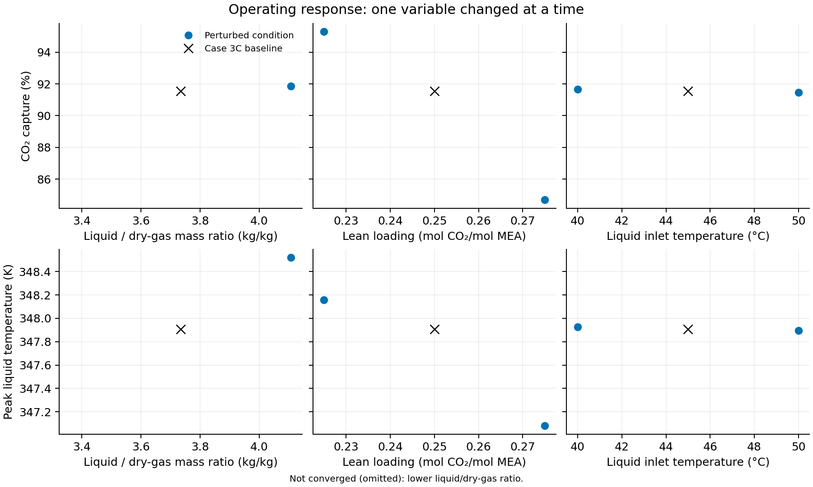

## Question and conditions

How do liquid-to-dry-gas mass ratio, lean loading, and liquid-inlet temperature change the coupled nine-species Case 3C prediction?
The baseline uses L/G = 3.734227521 kg/kg, loading 0.25 mol CO₂/mol MEA, and liquid-inlet temperature 318.15 K.
One input changes at a time: liquid mass flow ±10% at fixed reported dry-gas flow; loading 0.225 or 0.275; or inlet temperature 313.15 or 323.15 K.
Thermodynamic parameters, conventional enhancement, empirical calorics, and remaining operating inputs stay fixed.

The calculation uses 21 initial nodes, collocation tolerance 0.5, boundary tolerance 0.001 and a 1000-node limit.
Each condition first uses its own Henry-law initialization.
For the three unsuccessful starts, one explicitly selected retry uses the retained reactive Case 3C profile as initialization only; the solver interpolates it onto the requested mesh.
Each subprocess is limited to 900 seconds; concurrent runs use one BLAS/OpenMP thread each.
These wall times are not the manuscript's separate optimized-wheel timing measurements.

## Results

Six of seven conditions converge. Lower loading gives the largest positive capture response among these perturbations; higher loading gives the largest negative response.
A 10% higher liquid flow increases capture by 0.310487 percentage points.
A 5 K colder/warmer liquid inlet changes capture by +0.107302/−0.084819 points.



| Condition | Capture (%) | Change (percentage points) | Peak liquid temperature (K) |
| --- | ---: | ---: | ---: |
| baseline | 91.543287 | +0.000000 | 347.906471 |
| LG_low | No accepted result | — | — |
| LG_high | 91.853774 | +0.310487 | 348.520424 |
| loading_low | 95.297717 | +3.754430 | 348.157098 |
| loading_high | 84.683054 | -6.860233 | 347.079345 |
| temperature_low | 91.650589 | +0.107302 | 347.928203 |
| temperature_high | 91.458468 | -0.084819 | 347.896804 |

The peak-temperature changes for colder and warmer inlet liquid are +0.021731 and −0.009668 K.
Both are smaller than the earlier 0.04493 K joint mesh/tolerance refinement difference at baseline; their signs are not established as numerically resolved temperature trends.
The refinement difference is an indicator at one reference condition, not a certified error bound for these perturbations.
The +0.613953 K response to higher liquid flow and +0.250626/−0.827126 K responses to lower/higher loading exceed that indicator.

## Numerical checks and failures

All accepted results have 22 final nodes, two mesh iterations, maximum normalized RMS residual below 0.184, zero maximum scaled boundary residual, and no invalid-state or guard-penalty count.
All exported values are finite and true-species flows and concentrations are positive.
CO₂ and water axial molar-balance ranges are below 1.8e-15 and 4.3e-14 mol/s.
Component and charge discrepancies are below 1.56e-11 and 2.21e-15 mol/s; normalized-feed checks use the repository's 1e-8 component and 1e-10 charge tolerances.
Axial net-enthalpy-flow ranges span 160.21–390.32 W, compared with 293.22 W at baseline: the numerical enthalpy-flow discrepancy remains.
The continuous adopted balance conserves signed net enthalpy; this observed discrepancy is distinct from uncertainty in the empirical caloric formulas.
The baseline capture differs from the retained same-wheel Case 3C result by about 6e-11 percentage points.

Higher liquid flow initially exhausts the Henry initializer's mesh limit, then converges from the reactive profile.
The colder inlet first reaches a non-positive molar-flow reactive trial, then converges from the reactive profile.
Lower liquid flow fails at an intermediate reactive equilibrium calculation from both initializations (`infeasible_problem_detected`, `ipopt_solve_failed`).
That result does not establish physical infeasibility; it leaves the low-L/G prediction unavailable.
Original attempt logs and both initialized attempts are retained alongside successful results.
Two early interrupted trials under an insufficient 240-second budget remain separately under repository-relative `analyses/nccc_validation/results/runs/reactive_operating_budget_probe_20260904/` and contribute no plotted values.

These are discrete predictions at the specified conditions, without validation observations at perturbed conditions, joint uncertainty, interactions, or an energy/cost objective.
No operating optimum is established.

## Reproduction and provenance

The investigator requested rerunning the missing operating study and producing its figure for the current manuscript.
Independent numerical review supports these retained values and plotted points for manuscript use, with the missing lower-flow condition, coarse resolution and empirical caloric limitations stated above.
The investigator’s rerun request continues the authorized operating-figure integration.
This notebook records the completed study; changed calculation results require reassessing its table and prose before rendering.

The selected immutable wheel is Engine `9e1bef97fbea5c6f465612ae27b054192f91f19c`, SHA-256 `b011d0f9d492e9db197f67cc0ae6781ac636fa3278805ddf1d6a05ecd167074b`.
The parameter JSON SHA-256 is `a9186c93759f2e2c02a6c913350ad06a244fff3f82503820c9962b3df8dd40d9`.
Every accepted run has unchanged recorded source/input hashes and the same wheel and parameter identities.

- Numerical authority: [summary.csv](output/summary.csv), [temperature profiles](output/temperature_profiles.csv).
- Input and render hashes: [provenance.json](output/provenance.json).
- Raw inputs, identities, results, profiles, execution records and logs: repository-relative `analyses/nccc_validation/results/runs/reactive_operating_rerun_20260904/`.
- Figure: [PDF](output/operating_response.pdf), [SVG](output/operating_response.svg).

From the repository root, run these commands into a new output directory or after explicitly preserving an earlier run:

```bash
uv run --frozen python scripts/check_epcsaft_integration.py --mode final
uv run --frozen python analyses/nccc_validation/figures/reactive_operating/scripts/generate_data.py
uv run --frozen python analyses/nccc_validation/figures/reactive_operating/scripts/generate_data.py --initial-profile analyses/nccc_validation/results/runs/reactive_native_21/solution_scaled.csv --scenarios LG_low LG_high temperature_low
uv run --frozen python analyses/nccc_validation/figures/reactive_operating/scripts/render.py
bash analyses/nccc_validation/figures/reactive_operating/render.sh analyses/nccc_validation/figures/reactive_operating/notebook.qmd
```

Rendering reads retained results and does not run the model.
