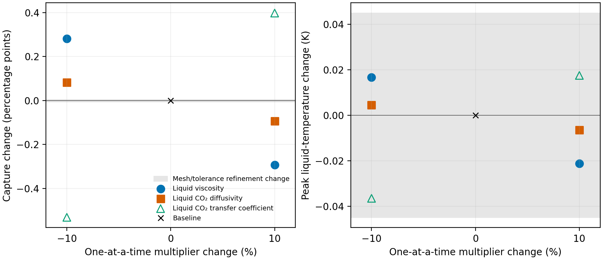
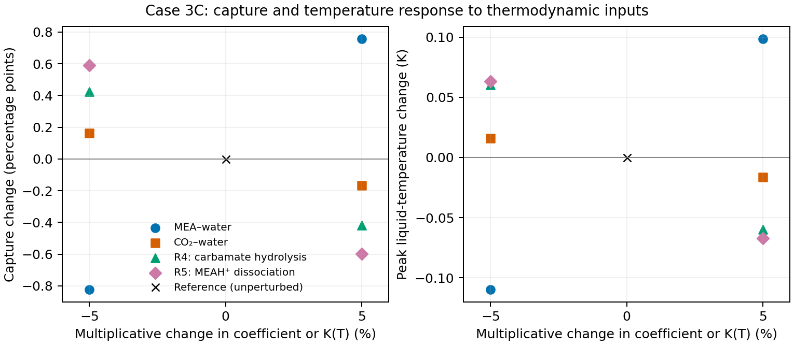
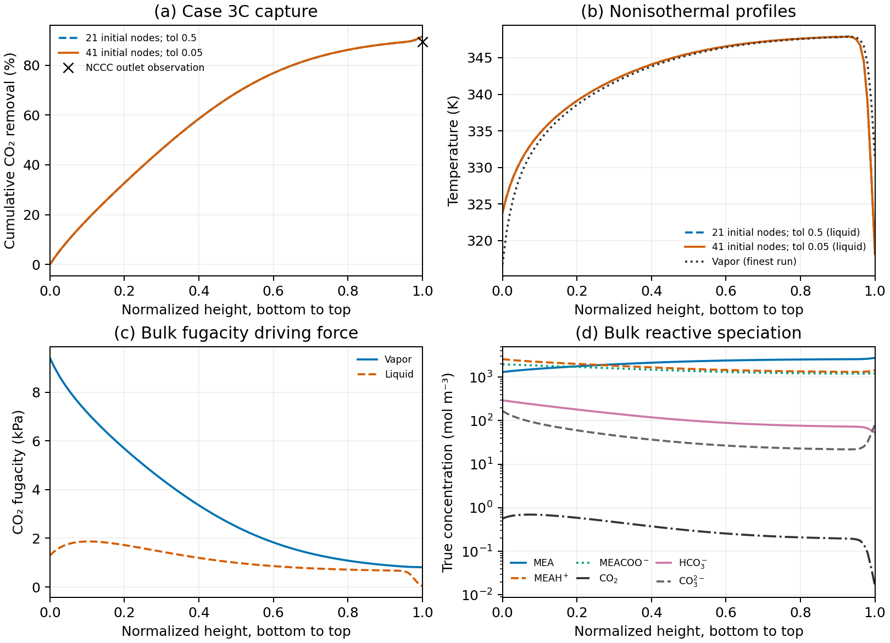
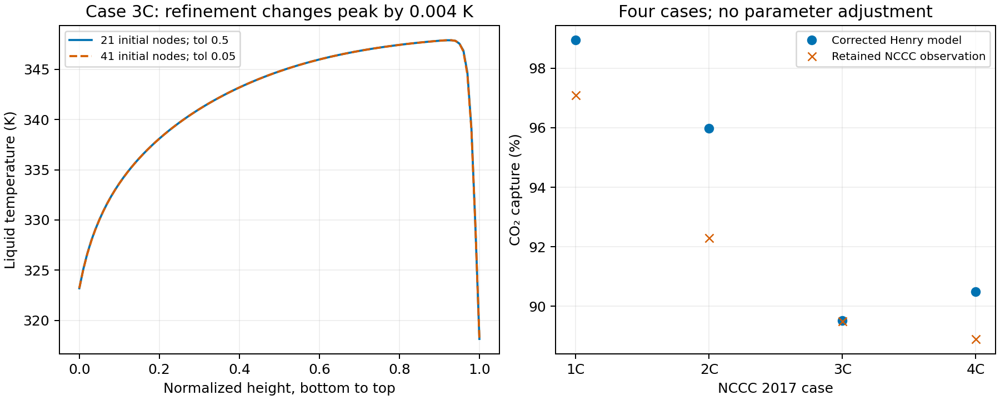

# Corrected energy and bounded column checks

Working evidence, 2026-09-04. The investigator explicitly authorized the current results for the R1.10/R1.11 numerical-diagnostics and computational-cost additions to the manuscript; this promotes the uncommitted notebook snapshot SHA-256 `16c161be5568cb719bdde5fb7a5b9914512cb480866656ae55977a62bf1b9ac1` for that bounded use, not a multi-case accuracy or general method-ranking claim. The checkout remains an uncommitted overlay on August base `0d4e552e15fdf9ee17edc64908c3a04a6525f98b`, not a newly committed notebook. The investigator requested this notebook format, so no parallel Quarto notebook was introduced.

R1.10 and R1.11 are addressed in manuscript Methods, the consolidated numerical-outcomes table and the coupled numerical-verification table. They report the available mesh/residual history, mesh-iteration count, Jacobian/RHS evaluations, CPU/wall timing and hardware conditions. Four Jacobian batches cover 84 and 164 local state derivatives; the Methods text includes the lean/rich directional verification and full nonisothermal derivative assembly. Memory, inner-Newton histories and iteration counts for rejected competing-method attempts remain explicitly unavailable rather than fabricated. A matched multi-case study and a general performance ranking are not prerequisites for closing these reporting requests; the broader physical comparison remains R2.4.

`../../figures/reactive_column/output/iteration_history.csv` preserves printed outer-iteration values and cumulative callback counts. Its source logs are `../runs/reactive_native_21.log` (SHA-256 `2faa416f276b95b62f2830e6ffaa41503bf53f35a6d9494e04b41e82eb9153ab`) and `../runs/reactive_native_41.log` (SHA-256 `3d548480c7c71244aff63ee81df710d55e81872fc9c9406a8a259e7e46687883`). Printed residuals have only the precision emitted by SciPy; the final values in `summary.csv` retain additional precision.

## R1.9: retained transport sensitivity and manuscript integration

The investigator explicitly authorized the supplied transport notebook snapshot SHA-256 `2985e983a931c327f2968a8455b9196cbda0c9d3e15fdea3f2dff5fbda3f9446`, with scalar table SHA-256 `f114cfec689403d27ab1a00c136ba17b375abdfbb8012053f7fa585dfe8d55d7`, for the bounded Case 3C manuscript sensitivity comparison. The supplied study is an uncommitted snapshot from `ac57`, not a notebook commit; its source task reports independent review supporting this result and scaling implementation, not general-purpose initialization. This integration checks the retained data and presentation and does not claim a new independent model review.

The complete [transport notebook](../../../transport_sensitivity/notebook.html), [source](../../../transport_sensitivity/notebook.qmd), raw runs, failed attempts, initialization control and reproduction scripts are retained under `analyses/transport_sensitivity/`. The imported files preserve their original contents and execution-path provenance; no model source or default was replaced. All 136 top-level provenance input hashes matched the source package before import. Its baseline differs from the thermodynamic-study reference by only −2.27e-8 capture percentage points. Selected parameters, wheel, chemistry, conventional enhancement approach and Case 3C inputs match.



| Input | Capture change at −10% (percentage points) | Capture change at +10% (percentage points) |
|---|---:|---:|
| Liquid viscosity | +0.282078 | −0.292240 |
| Free liquid CO2 diffusivity | +0.082479 | −0.093328 |
| Liquid-side CO2 transfer coefficient | −0.531371 | +0.398125 |

The [retained scalar table](../../../transport_sensitivity/figures/response/output/summary.csv) owns the exact values; profiles retain dependent transport quantities. All seven points converge at 42 nodes after two mesh iterations, with maximum normalized residual below 0.044, zero maximum scaled boundary residual, positive species concentrations and no invalid-state penalties. Six assembled directional-derivative checks pass at one seven-state point per multiplier. The seeded factor-one control changes capture by 1.01e-11 points. Failed cold-anchor attempts remain in the supplied notebook and are not counted as column results.

Each capture response exceeds the previous 0.00510-point refinement change. Every peak-temperature response is below 0.037 K, smaller than the earlier 0.04493 K refinement change; no resolved thermal sign/ranking is claimed. Higher CO2 diffusivity modestly lowers capture under this closure: at corresponding profile positions, median liquid-coefficient, enhancement and product ratios are 1.047, 0.931 and 0.975. These are recoupled-profile comparisons, not fixed-state derivatives. The three transport perturbations share dependencies, and the ±10% range is exploratory rather than measured uncertainty. It must not be pooled statistically with the ±5% thermodynamic study or treated as a common input ranking.

Abstract, Methods, the existing thermodynamic-comparison Results subsection, Figures 5–6, Conclusion and Future Work now cover both sensitivity studies. R1.8 remains complete for the four thermodynamic inputs; R1.9 now includes quantitative column results beyond its earlier qualitative response. SRP and multi-case validation are separate work; no column was rerun for this integration. Titles and the AI-use disclosure are unchanged.

## R1.8: local thermodynamic sensitivity

All four one-at-a-time ±5% interaction perturbations give converged nine-species Case 3C columns. At these equal relative perturbations, capture responds more strongly to MEA–water than to CO2–water. The selected reference predicts 91.548387% capture and a sampled liquid-temperature maximum of 347.861545 K. The investigator explicitly promoted the discussed interaction results in notebook snapshot SHA-256 `802537a7af8acfd07aaddacf9319387a2b8d5d9c3ae9f7feba56dde82b16b115`, with scalar table SHA-256 `fdde1b3d2ac0b04954beb80983dea59b1b99accabb8259745d461093a4266364`, for the bounded Case 3C manuscript comparison, not a global sensitivity or uncertainty claim. This remains an uncommitted overlay on the August base, and the numerical/prose checks were performed by the implementing agent rather than an independent reviewer. Methods, the thermodynamic-comparison Results and Conclusion now include the result without changing manuscript titles.



| Interaction | Multiplier | Evaluated dimensionless coefficient | Capture (%) | Capture change (percentage points) | Peak liquid-temperature change (K) |
|---|---:|---:|---:|---:|---:|
| MEA–water | 0.95 | −0.069851124 | 90.725950 | −0.822437 | −0.109607 |
| MEA–water | 1.05 | −0.077203874 | 92.306572 | +0.758185 | +0.098636 |
| CO2–water | 0.95 | 0.012599735 | 91.711109 | +0.162723 | +0.015977 |
| CO2–water | 1.05 | 0.013926023 | 91.382629 | −0.165758 | −0.016515 |

The two selected coefficients are −0.07352749874985018 and 0.013262879176919628, respectively. Each multiplier changes only its named pair interaction in both liquid and vapor EOS calculations. The adopted parameter file remains byte-identical to the MEA-Thermodynamics selection. Reaction constants, other coefficients, transport correlations, conventional enhancement, energy equations and Case 3C operating conditions are unchanged. All runs start from the accepted refined profile, using 41 initial nodes, collocation tolerance 0.05, boundary tolerance 0.001 and a 1000-node limit. Peak temperatures are maxima over the same 101 exported axial positions. Points denote separate calculations; no fitted curve or uncertainty band is implied.

Every case finishes with 42 nodes after two mesh iterations. Maximum normalized RMS residuals range from 0.042264 to 0.043928, below the requested 0.05; maximum scaled boundary residuals are zero. All nine concentrations remain positive, with no invalid-state or penalty evaluations. The maximum species-balance discrepancy is 1.40e-11 mol/s and charge discrepancy is 2.06e-15 mol/s. Net-enthalpy-flow ranges are 266.78–278.60 W, comparable to the 273.01 W reference. Exact diagnostics, flows, concentrations and temperatures are retained in the linked values below.

The capture shifts of 0.163–0.822 percentage points exceed the earlier reference refinement change of 0.005100 percentage points. The MEA–water peak-temperature shifts of about 0.10 K exceed the 0.044926 K reference refinement change; the CO2–water shifts of about 0.016 K are smaller and are not presented as a resolved temperature effect. The earlier refinement difference is a numerical comparison, not a rigorous error bound for every perturbed solution.

The ±5% range is sufficient to demonstrate local capture sensitivity. A ±10% extension could assess departure from the local response; ±20% would be a broader stress test. A larger multiplier is not inherently a better analysis, and none is a confidence interval without parameter-fit uncertainty. The interaction calculations vary two coefficients separately at one operating condition; the reaction-equilibrium extension below adds two more inputs. Neither propagates correlated parameter uncertainty or varies transport parameters. All eight capture predictions remain above the observed 89.50%; the perturbations are not a refit to that observation. Wider interaction/reaction uncertainty and the R2.5 operating-condition study remain subsequent analyses.

The first +5% CO2–water attempt rejected a vapor-density equilibrium root (42.03 mol/m³). Its exact stopping state passes on a certified liquid root (50951.50 mol/m³) using a fresh loading path. Conservative warm starts are therefore restricted to composition changes within the existing 0.1 logarithmic loading-step bound; larger jumps use the declared loading path before solving. The completed +5% run uses this restriction. Other runs used the preceding warm-start policy but still enforced the same native numerical, physical and liquid-root checks. No equation, coefficient or root-identity tolerance was altered for this initialization correction. The failed attempt and the fresh-state comparison remain retained. The +5% MEA–water launcher reported exit 143 after writing its complete successful result and profiles; the termination cause is not established. Its retained solution passes the same value, residual, positivity and conservation checks; launcher termination is not counted as numerical convergence evidence.

[summary.csv](../../figures/reactive_column/output/sensitivity/summary.csv) owns the exact scalar values; [profiles.csv](../../figures/reactive_column/output/sensitivity/profiles.csv) owns the plotted solutions. [provenance.json](../../figures/reactive_column/output/sensitivity/provenance.json) retains the full run identities and input hashes. The same directory retains all four evaluated parameter documents and the rejected/fresh state comparison. Raw outputs remain in `../runs/r18_mea_water_095/`, `../runs/r18_mea_water_105/`, `../runs/r18_co2_water_095/` and `../runs/r18_co2_water_105_guarded/`, with adjacent logs. Commands are in `REPRODUCE.md`. Focused checks for the interaction study: 84 passed with one expected legacy-domain warning; the immutable-wheel integration check passes. The investigator subsequently authorized manuscript insertion and the R4/R5 extension. No wider perturbation range, fitting or commit was performed.

### R4/R5 equilibrium-constant extension

All four requested reaction variants converge and their launchers exit zero. R4 is carbamate hydrolysis; R5 is protonated-MEA dissociation. Each variant multiplies only the named equilibrium constant by 0.95 or 1.05 at every temperature: `ln K*(T) = ln K(T) + ln(factor)`. R4 adds `ln(factor)` to its natural-log correlation intercept; R5 subtracts `log10(factor)` from its negative-log10 correlation intercept. The temperature derivative of ln K, other reactions, standard states, EOS parameters, kinetic inputs and conventional enhancement formulation remain unchanged. The selected source files are not edited. These are equilibrium-constant sensitivities, not kinetic-rate perturbations or newly fitted parameters.

| Equilibrium constant | Multiplier | Capture (%) | Capture change (percentage points) | Peak liquid-temperature change (K) |
|---|---:|---:|---:|---:|
| R4, carbamate hydrolysis | 0.95 | 91.973160 | +0.424773 | +0.060286 |
| R4, carbamate hydrolysis | 1.05 | 91.131308 | −0.417079 | −0.059870 |
| R5, protonated-MEA dissociation | 0.95 | 92.137757 | +0.589370 | +0.063066 |
| R5, protonated-MEA dissociation | 1.05 | 90.949515 | −0.598872 | −0.067209 |

At the chosen equal ±5% perturbations, MEA–water produces the largest absolute capture response, followed by R5, R4 and CO2–water. Reaction equilibrium is therefore relevant but does not give the largest response in this particular comparison. Every capture effect exceeds the 0.005100-percentage-point reference refinement difference. The reaction temperature shifts of 0.060–0.067 K are only modestly larger than the 0.044926 K refinement difference; this is not a rigorous error bound for every perturbed solution. No pure-component sweep, wider multiplier range or general parameter ranking is claimed.

Across all eight perturbations, final meshes contain 42 nodes after two iterations, maximum normalized RMS residuals are below 0.044 and maximum scaled boundary residuals are zero. No invalid-state or penalty evaluations occur; all nine concentrations remain positive. Maximum species and charge discrepancies are 1.481482e-11 and 2.385448e-15 mol/s, respectively. The net-enthalpy-flow range remains 266.78–278.60 W across the combined study. These checks support the local numerical comparison, not a multi-case validation campaign.

The shared scalar table now contains the reference plus eight variants; profiles contain 101 positions for each. Four evaluated reaction documents and their hashes are retained alongside the four interaction documents in the figure output. Raw reaction outputs and adjacent logs are `../runs/r18_r4_095/`, `../runs/r18_r4_105/`, `../runs/r18_r5_095/` and `../runs/r18_r5_105/`. The reproduction command uses the same refined reference and numerical settings as the interaction comparison. All four reaction runs retain the reference EOS fingerprint `sha256:07e3f93b209d8e117af4b69e2d0ab3b5bc0b2e94568643c28629e4799d8aa062`.

Final implementation checks: 87 passed with one expected legacy-domain warning, including reaction-multiplier invariants and native/AD directional checks for perturbed equilibrium states. The immutable-wheel integration check passes. The investigator authorized this extension and its integration with the preceding manuscript comparison; Methods, Results Figure 5, Conclusion and Future Work now distinguish the completed local study from broader uncertainty and operating-condition work. The implementing agent checked values and presentation; this is not an independent review or a committed notebook release.

## Current nine-species nonisothermal result

The selected-parameter Case 3C column converges with the conventional enhancement-factor approach and empirical energy balance. The current result supersedes the timeout and local-equilibrium-only conclusions retained below. No older 71% result or historical six-species figure is used as evidence for this calculation.

Final checks: 80 passed in 48.80 s across `test_reactive_column_jacobian.py`, `test_column_energy.py`, `test_transport_domain_guards.py`, `test_epcsaft_reactive_chemistry.py`, `test_thermodynamics_adapter.py` and `test_robust_convergence.py`. The sole warning is expected from the deliberately nonraising legacy domain probe. The immutable-wheel integration check passes. These checks cover the implementation, not agreement with absorber measurements.



| Initial nodes / tolerance | Final nodes / iterations | Capture (%) | Maximum normalized RMS residual | BVP CPU / wall (s) | Total wall including initialization and output (s) |
|---|---|---:|---:|---:|---:|
| 21 / 0.5 | 22 / 2 | 91.543287 | 0.125340 | 309.481 / 309.853 | 418.663 |
| 41 / 0.05 | 42 / 2 | 91.548387 | 0.043138 | 515.481 / 517.139 | 622.446 |

Observed capture is 89.50%; the refined prediction is 2.048387 percentage points higher. Mesh/tolerance refinement changes capture by 0.005100 percentage points and sampled peak liquid temperature by −0.044926 K, from 347.906471 to 347.861545 K. Both runs have zero maximum scaled boundary residual; the separately postprocessed six-percentage-error norm is zero and 1.85e-14. No invalid-state or penalty evaluation was recorded. These are modest discretization checks, not an asymptotic convergence study or proof of physical accuracy.

On the 101 exported positions, CO2 and water net-flow ranges are at most 1.78e-15 and 2.84e-14 mol/s. The largest nine-species component-balance discrepancy is 1.37e-11 mol/s and charge discrepancy is 2.24e-15 mol/s. All nine true concentrations are positive (minimum 2.19e-6 mol/m³), temperatures stay between 316.75 and 347.91 K, and the refinement's enhancement factor spans 94.30–446.24 without reaching its imposed upper bound. The range of `Hvf - Hlf` decreases from 293.219 to 273.006 W; those values are 0.00653% and 0.00608% of the maximum net enthalpy flow under the specified empirical reference. Report the watt imbalance alongside that reference-dependent percentage. Native equilibrium acceptance and liquid-root checks are enforced throughout. Temperature measurements are not plotted or assigned RMSE without confirmed phase and axial-coordinate mapping.

Exact plotted values, including all nine species, are in [profiles.csv](../../figures/reactive_column/output/profiles.csv). [summary.csv](../../figures/reactive_column/output/summary.csv) retains the scalar diagnostics, and [provenance.json](../../figures/reactive_column/output/provenance.json) retains input/source hashes, complete run identities and the local Jacobian timing comparison. Raw results and logs remain in `../runs/reactive_native_21/`, `../runs/reactive_native_41/` and their adjacent `.log` files. Both bounded processes exited successfully. The first uses a same-case Henry solution only as an initial guess; the refinement uses the accepted current profile. Final equations use the selected nine-species thermodynamics in both runs.

Final liquid-native counts, including exported profiles, are 335 solves / 582 queries / 252 exact cache hits for the first run, and 499 / 961 / 468 for refinement. Each run has four Jacobian batches; already evaluated node and midpoint states require no additional liquid equilibrium solves during those batches. The first run's legacy chemistry counters predate the diagnostic-field repair; use its explicit `reactive_evaluations` and native evidence, not default zeros or a default false Boolean as a scientific result. The refinement retains the repaired fields as well.

For the same corrected physical equations at the supplied rich point, SciPy forward differences including the base state took 65.862165 s and 56 native solves. Native/AD assembly with that base already evaluated took 0.017562 s and no additional native solve; evaluation of its base required seven native solves and 7.391894 s of native time. These timing windows are different and do not imply a whole-column speedup ratio. The earlier 300 s run returned no accepted result. The single-column CPU/wall measurements include incidental shared-machine activity and are not repeated, isolated performance benchmarks; memory was not measured.

Manuscript-ready interpretation: For NCCC Case 3C, the coupled nine-species ePC-SAFT calculation with conventional reaction enhancement predicts 91.55% CO2 capture, compared with 89.50% measured. Refining the initial mesh from 21 to 41 points and reducing the collocation tolerance from 0.5 to 0.05 changes capture by 0.0051 percentage points and peak liquid temperature by 0.045 K. The small refinement changes support numerical resolution of this case but do not explain the 2.05-percentage-point capture discrepancy. The profiles show declining vapor CO2 fugacity along the bed, positive absorption driving force, and a liquid-temperature maximum of approximately 347.86 K. Broader case comparisons and thermodynamic/operating sensitivity are needed to assess predictive performance beyond this condition.

R1.10 and R1.11 are closed as reporting responses with the explicit scope above. R2.4 has one converged selected-reactive column in addition to the four Henry reference cases, not a completed selected-reactive campaign. R1.8 is addressed by the completed interaction and R4/R5 equilibrium-constant sensitivity comparison in the manuscript. R2.5 controlled operating-condition studies can start from this current reference. Broader parameter uncertainty and operating-condition studies remain subsequent scientific additions. The historical parameter tables, aggregate statistics and figures must be replaced together when that matched campaign is ready.

## Conventional-film coupling and numerical evaluation

This section supersedes the older fresh-loading-path-only description below. The investigator requested a current-parameter nonisothermal column, reuse of native derivatives, and correction of demonstrated enhancement coupling errors. The selected parameters, reaction constants, empirical enthalpies, rate coefficients and enhancement formula remain unchanged. No eNRTL or resolved reactive-film calculation is required.

The conventional two-film equations are `N = k_g(f_g - f_i) = E k_l(C_i - C_b)`. For a locally constant free-solute fugacity/concentration coefficient, `f_i = H_bulk C_i` and `f_b = H_bulk C_b`, elimination of the interface state gives `N = k_g [E k_l/(E k_l + k_g H_bulk)] (f_g - f_b)`. Here `H_bulk = f_b/C_CO2,free`, in Pa m³/mol. It is a secant with the bulk activity coefficient held fixed across the film, not a differential coefficient along reactive loading. That approximation is explicit; a full nonlinear interfacial thermodynamic calculation remains outside this conventional closure.

The former nine-species code combined EOS fugacity with an unrelated empirical Henry coefficient in this resistance. The current coupling uses the same bulk EOS fugacity and free molecular CO2 concentration in both places. It does not use total absorbed carbon, the derivative with respect to total loading, or the enhancement-only empirical concentration divisor. The baseline Henry calculation remains unchanged. This is a physical coupling correction, separate from computational acceleration, so before/after column predictions would not isolate speed alone.

Free MEA and water concentrations enter the retained concentration-weighted Luo kinetics; true ionic concentrations enter the explicit enhancement expression. All are true mole fractions times EOS true-species molar density, in mol/m³. The apparent-MEA diffusion correlations retain their empirical density and their separate mol/L conversion where required. The explicit enhancement remains bounded between 1 and 10,000; the original factor 1.04542981654115 affects only free CO2 in that expression and remains a disclosed empirical input with unresolved calibration provenance. Bulk reaction equilibrium fixes the bulk state; the enhancement approximates reaction within the liquid film. Neither alone implies duplicated reaction enhancement. The independent interface-balance check covers absorption, equilibrium and desorption signs, including the unenhanced limit.

The nonisothermal Jacobian maps native liquid and neutral-vapor T/P/composition sensitivities into shared absorber expressions. CasADi differentiates transport, kinetic, fugacity-to-concentration conversion and the full empirical-energy chain rule. No production finite differences are used in this assembly. The ordinary guarded RHS runs before derivative assembly, and its value is checked against the differentiated expressions. Lean and rich directional comparisons pass against centered differences with nonunit state scales. The isothermal b6f5 implementation supplied the native invariant mapping and shared transport expressions, not its different concentration or vapor approximations.

For the supplied rich state, a fresh evaluation took 8.282385 s and seven native solves (7.727187 s inside those solves). An exact repeat took 0.000144 s with no solve. Changing temperature to 325.001 K and CO2 amount by a factor 1.00001 took 1.184077 s and one native solve. These are local measurements, not whole-column speedups. Cached keys retain exact T/P/apparent amounts and request/initialization options within an immutable model instance; returned values are copied. Warm starts conservatively map certified native amounts and preserve native physical, material, reaction and liquid-root checks. Rejected native states do not update the seed. A bounded 2048-entry cache evicts by recomputation, never rounding or interpolation.

The current column uses `run_reactive_column.py`, raw scaled coordinates, boundary tolerance 0.001 and the existing 1000-node limit. The initial full-composition anchor uses loading 0.25 and the inlet water/MEA ratio. Progress includes RHS/Jacobian batches and cumulative native counts/timing; the converged results and refinement are summarized above.

## Earlier nine-species replay after the Orchestrator handoff

The selected nine-species set now passes both the independent working reference and the exact previously rejected state in this backup worktree. The failed old-wheel/unseeded invocation below is not evidence that the parameter set cannot work, and its attribution to an Engine solve-coverage problem was premature.

| State | Liquid density (mol/m³) | CO2 fugacity (Pa) | Balance infinity norm | Reaction-affinity infinity norm |
|---|---:|---:|---:|---:|
| Reference: 318.15 K, 110900 Pa | 53024.00899976211 | 8710.019674586434 | 1.39e-16 | 1.42e-13 |
| Previous failure: 325 K, 109500 Pa | 51179.28088199359 | 1622.949444608249 | 6.38e-16 | 1.71e-13 |

Exact feeds and residuals are retained in `nine_species_replay.csv`. Both native physical certificates and liquid-root identity checks pass. A table suffices for these two scalar equilibrium checks; no axial profile or interpolation is implied. This establishes working homogeneous nine-species equilibrium, not a full-column solution.

The installed immutable Engine build is `9e1bef97fbea5c6f465612ae27b054192f91f19c`, wheel SHA-256 `b011d0f9d492e9db197f67cc0ae6781ac636fa3278805ddf1d6a05ecd167074b`, native SHA-256 `b5f97d49eb9439da84312dbeacb8ac0bae26ce6939562339a3c73d842fccce34`. Parameter SHA-256 remains `a9186c93759f2e2c02a6c913350ad06a244fff3f82503820c9962b3df8dd40d9`; the matching source reaction export is `810dfec15760cf74451df91743d6e63684cee93ddaf3e1ff4e42bf4a686afe29` and reference thermochemistry is `a24a6b3c8b506fc659fc1bbd8a470b55919ba93da23eea27ffdf882645706185`. The complete bundle is validated together; its old wheel field describes export provenance, not the newly installed runtime.

The thermodynamics wrapper was reconciled from the Orchestrator's verified 6c99 source (`reactive_bundle.py` SHA-256 `f6a3e75646cf30702271af62fe1c4c57fa0932a37243ca1a78ff97e30284379e`), with unused film derivative/action consumers omitted. Every query starts fresh at loading 0.25, at that query's temperature, pressure and MEA/water ratio, then follows conservative positive starts in log-loading steps no larger than 0.1 (maximum 32 steps). It checks native conserved quantities and the certified liquid pressure root at every step; no solved-state cache, automatic anchor retry or tolerance relaxation is used. All steps request the native A1 route so explicit starts are honored.

The reaction export stores source R2/R4/R5 coefficients; typed fitted correlations in the unchanged parameter file supersede them completely, without adding the molality offset twice. All five effective ln K values agree with the previous implementation at 298.15, 318.15, 325 and 353.15 K. Thus the combined runtime/initialization correction resolves the failed point without fitting parameters or changing reaction constants. This comparison does not isolate how much of the correction came from the wheel versus the initialization.

The existing flux, enhancement, apparent-to-true concentration conversion and empirical column caloric model remain unchanged. The matching native reference is supplied for the native state calculation, not substituted into the column energy equations. No article prose or title was changed by this replay.

```bash
OPENBLAS_NUM_THREADS=1 OMP_NUM_THREADS=1 MKL_NUM_THREADS=1 uv run --frozen pytest tests/test_epcsaft_reactive_chemistry.py -k 'conserves_elements or loading_path_budget' -q
```

For a direct call, use `reactive_liquid().solve(T, P, apparent_amounts, state_input_derivatives=True)` from `mea_absorption_column.Thermodynamics.reactive_bundle`, with the unnormalized apparent amounts in the retained CSV. Do not normalize them a second time or reuse true-species amounts as apparent flow rates.

At the time of this replay, an accepted axial column calculation remained. The current result above supplies it. Earlier failed attempts below remain identified by their original inputs and runtime.

## Earlier current-wheel column timeout

The selected nine-species Case 3C collocation calculation reached its 300 s subprocess limit after 300.118216 s wall time. It returned no capture, final profile, iteration count or residual history. This is an execution limit, not evidence of an equilibrium-certificate failure or physical nonexistence. The child process was stopped and verified absent. No solver tolerance, parameter, flux or enhancement formula was changed. A scalar record is sufficient because no axial result exists to plot.

The attempt used the 2017 mass-input Case 3C, dry-saturated vapor reconstruction, reported dry gas mass basis, temperature-state energy equations, 21 initial mesh points, tolerance 0.5, boundary tolerance 0.001 and maximum 1000 nodes. Raw records are in `../runs/reviewer_nine_current_20260904/`: `run_identity.json` SHA-256 `f11f3f67d6a4a5c04659b80eb2ff359bc12dd73399063698620c41c8b9baefbc`, and `benchmark_results.csv` SHA-256 `81afb9b92c67e384cc481dd0b0a4a131fef32513a3984c5cb8defd21ccfb8014`. The compact retained row is `current_column_attempt.csv`. The generic timeout row does not locate the internal stopping stage; its default stage label must not be interpreted as proof that the solver never started. The elapsed time overlapped document rendering and is not a controlled computational-cost comparison.

The next numerical check should expose local equilibrium-evaluation cost and column-iteration progress before selecting a longer run. The previous two certified local states remain valid evidence, but do not supply an axial solution. Historical manuscript figures and parameter tables remain paired.

## Question and retained model

Can the corrected energy formulation produce useful column, refinement and cost evidence for R1.10, R1.11 and R2.4 while retaining the selected nine-species inputs and existing flux/enhancement formulas?

The countercurrent coordinate increases from vapor inlet to liquid inlet. With additive empirical component enthalpies, the repaired equations conserve `Hv_flow - Hl_flow`; the temperature chain rule uses each transferring component's enthalpy and the actual flow derivative. Constant liquid enthalpy offsets have zero temperature derivative. The default temperature guess interpolates temperature endpoints rather than applying enthalpy-polynomial coefficients to kelvin. No flux, enhancement, parameter or reaction-constant fit was made.

Five new energy checks cover three independent temperature derivatives and Henry/reactive local energy conservation and enthalpy/temperature-state equivalence. Together with existing focused chemistry and convergence checks, 50 tests pass. These checks verify the implementation, not capture accuracy.

## Results



The left panel compares continuous Henry liquid-temperature profiles. The right uses discrete calculated and observed capture values; no observational uncertainty was supplied. These are not fits. Exact plotted temperatures are in `temperature_profiles.csv`; results and diagnostics, including failed attempts, are in `summary.csv`.

| Case / calculation | Capture (%) | Observed (%) | CPU / wall (s) | Iterations / final nodes | Maximum RMS residual |
|---|---:|---:|---:|---:|---:|
| 1C Henry | 98.94346 | 97.1 | 4.404 / 6.115 | 2 / 22 | 0.08914 |
| 2C Henry | 95.97282 | 92.3 | 5.818 / 7.283 | 2 / 22 | 0.10068 |
| 3C Henry, coarse | 89.52354 | 89.5 | 10.712 / 13.312* | 3 / 35 | 0.05452 |
| 3C Henry, refined | 89.52775 | 89.5 | 8.377 / 9.557 | 2 / 72 | 0.009276 |
| 4C Henry | 90.48046 | 88.9 | 6.399 / 7.932 | 2 / 27 | 0.08581 |

Coarse settings: initial mesh 21, tolerance 0.5, boundary tolerance 0.001, maximum nodes 1000. Refined: initial mesh 41, tolerance 0.05; other settings unchanged. Each accepted collocation calculation has maximum scaled boundary residual zero at native precision. Final profiles were exported through the actual column evaluator. Guarded invalid trial iterates occurred (recorded in `summary.csv`), so successful final solutions must not be described as zero-invalid-iterate calculations.

Case 3C capture changes by 0.004206 percentage points and sampled peak liquid temperature by 0.003980 K (347.89198 to 347.89596 K). Net-energy range over the 101 exported profile points falls from 299.30 to 18.92 W. This is a bounded numerical-accuracy check, not an asymptotic convergence study or a prescribed physical acceptance threshold. Henry capture errors across four cases are +0.02775 to +3.67282 percentage points using refined 3C. The current reactive prediction is reported separately above. No temperature-tap RMSE is asserted until source coordinate/phase mapping is confirmed.

Machine: AMD Ryzen 5 5500; CPython 3.13.13, NumPy 2.4.4, SciPy 1.17.1. OPENBLAS_NUM_THREADS, OMP_NUM_THREADS and MKL_NUM_THREADS were set to one. CPU time measures the solver segment inside the worker, excluding profile export. The benchmark's wall time measures the whole subprocess attempt, including startup and profile export; these are different timing windows and must not be used to infer CPU utilization. *The coarse repeat overlapped a focused test, so its wall time is not a controlled timing comparison. The earlier isolated coarse attempt used 10.976 CPU s / 17.193 wall s with the same capture and native diagnostics, but its enthalpy profile labels predate the explicit-label repair. Do not use those old enthalpy labels. These single attempts establish no method speed ranking. Peak memory was not measured.

## Failed attempts and native equilibrium diagnosis

Shooting and finite difference were tried on the same Henry Case 3C with a 90 s per-attempt timeout. Shooting was rejected with boundary residual norm 78.0327%; its profile required the existing temperature-only fallback. Finite difference returned zero capture and was rejected by the existing capture check. Neither is an accepted physical solution. Native iteration/node counts are unavailable for these methods, not zero. Their wall times (17.794 and 6.471 s) are failure costs, not successful-solution costs.

The selected `epcsaft_reactive_nine` Case 3C attempt stopped at its first initial-profile state: T = 325 K, P = 109500 Pa, apparent CO2/MEA/H2O amounts `[4.087096190146402, 9.729875260332735, 75.2853477794609]`, loading 0.4200563811 mol/mol. The native optimizer reports `solve_succeeded`, but the physical result is `reactive_finite_phase_certificate_failed`. The diagnostic retry failed after 5.002 s. Capture, column residuals and iteration counts are unavailable.

Direct calls through the same `homogeneous_reactive_request` and installed `equilibrium.solve` give:

| T (K) | Loading (mol/mol) | Native balance infinity norm | Reaction-affinity infinity norm | Physical certificate |
|---:|---:|---:|---:|---|
| 325 | 0.4200563811 | 0.03412981 | 1.2185501 | Failed |
| 318.15 | 0.4200563811 | 0.002455595 | 5.9565522 | Failed |
| 325 | 0.25 | 4.38e-17 | 5.68e-14 | Passed |

All probes use P = 109500 Pa and the same MEA/H2O ratio; the last changes only apparent CO2 to 0.25 times MEA. These are native dimensionless residuals, not column residuals. The first has local stability marked passed, the second failed; numerical success does not override either physical rejection. A small table is sufficient for this diagnosed negative result; a curve between these three states would imply uncomputed evidence.

These old-wheel/unseeded failures did not establish physical nonexistence or a parameter defect. The replay above supersedes the earlier inference of incomplete Engine solve coverage: the exact state passes with the supplied runtime and conservative initialization. No Henry substitution, certificate relaxation, rebasing or new fit was used.

## Repetition and remaining reviewer work

Run from the attached repository with the immutable wheel and selected bundle identified in `REPRODUCE.md`. The working overlay remains uncommitted; the August base alone does not reproduce it.

```bash
export OPENBLAS_NUM_THREADS=1 OMP_NUM_THREADS=1 MKL_NUM_THREADS=1
uv run --frozen pytest tests/test_column_energy.py tests/test_epcsaft_reactive_chemistry.py tests/test_robust_convergence.py -q
uv run --frozen python analyses/nccc_validation/scripts/run_reviewer_validation.py --model ideal_henry --cases 1C 2C 3C 4C --output analyses/nccc_validation/results/runs/reviewer_repeat_henry
uv run --frozen python analyses/nccc_validation/scripts/run_reviewer_validation.py --model ideal_henry --mesh 41 --tol 0.05 --output analyses/nccc_validation/results/runs/reviewer_repeat_refined
uv run --frozen python analyses/nccc_validation/scripts/run_reviewer_validation.py --model ideal_henry --methods single finite --timeout 90 --output analyses/nccc_validation/results/runs/reviewer_repeat_methods
uv run --frozen python analyses/nccc_validation/scripts/run_reviewer_validation.py --output analyses/nccc_validation/results/runs/reviewer_repeat_reactive
uv run --frozen python analyses/nccc_validation/scripts/render_reviewer_validation.py
```

Each output directory must be new. The renderer reads the named retained original attempts, not the repeat folders; it never runs a model. `provenance.json` identifies its inputs and renderer. Full raw run folders are local ignored evidence, while this summary, plotted values and provenance are retained outside them. Preserve those raw directories if archiving this working revision.

For the current reactive calculation and refinement commands, use the Current nonisothermal column section of `REPRODUCE.md`. Reviewer progress is summarized at the top of this record. An energy/cost objective and hydraulic limits are required before claiming an operating optimum.
