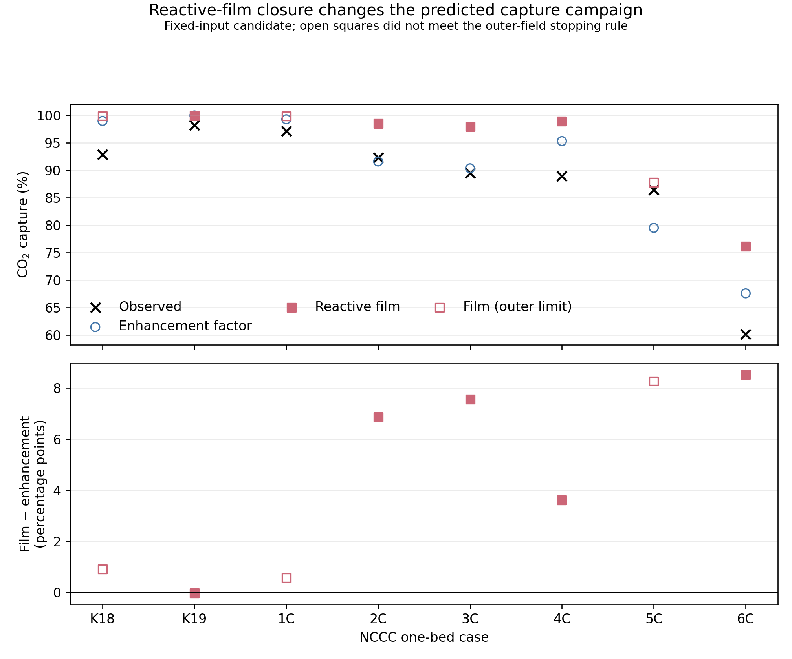
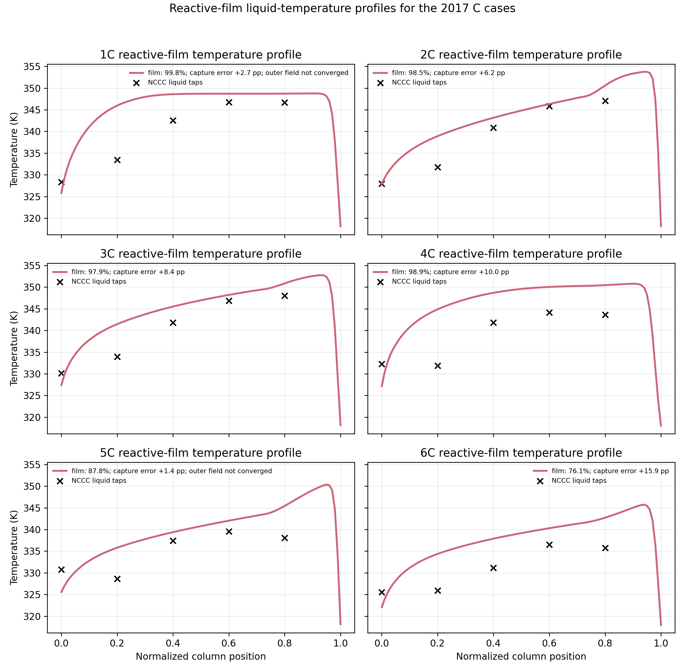
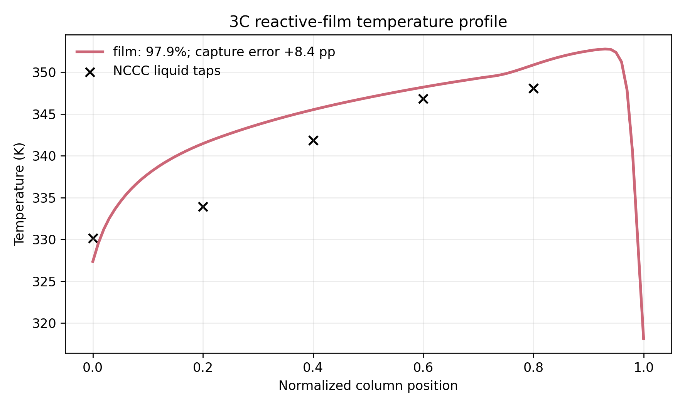

## Decision

The nine-species fast-equilibrium film model is adopted as the primary CO2 mass-transfer calculation for the eight retained one-bed cases. The former enhancement-factor calculation is retained only as a comparator. The film model is not fitted to the measured capture percentages.

## Formulation

At each sampled packed-height location, the selected ePC-SAFT bundle supplies a homogeneous nine-species equilibrium state and exact chemical-potential composition tangent. A symmetric positive-semidefinite pair-mobility approximation maps that tangent to species fluxes after projecting out total molar flow, electrical current, nonvolatile-MEA flux, and water-component flux. Water transfer remains the column model's separate two-film calculation. Integration along the fast-reaction equilibrium manifold gives the liquid-film CO2 component flux, and a scalar gas-film balance determines the interface state.

The local film solve is quadrature plus a scalar interface root; it does not impose independent boundary conditions on nine differential species profiles. The packed column remains a boundary-value problem because vapor and liquid enter from opposite ends.

## Retained campaign

| Case | Observed (%) | Enhancement (%) | Film (%) | Film − enhancement (points) | Outer field converged |
|---|---:|---:|---:|---:|:---:|
| K18 | 92.85 | 98.969 | 99.884 | +0.914 | No |
| K19 | 98.21 | 99.968 | 99.938 | −0.031 | Yes |
| 1C | 97.10 | 99.271 | 99.842 | +0.571 | No |
| 2C | 92.30 | 91.596 | 98.462 | +6.866 | Yes |
| 3C | 89.50 | 90.356 | 97.913 | +7.557 | Yes |
| 4C | 88.90 | 95.306 | 98.916 | +3.611 | Yes |
| 5C | 86.40 | 79.516 | 87.789 | +8.273 | No |
| 6C | 60.20 | 67.605 | 76.131 | +8.526 | Yes |

Exact values and diagnostics are retained in `results/final/tables/column_film_capture_comparison.csv`.

{width=95%}

The reactive-film closure changes predicted capture by -0.031 to +8.526 percentage points relative to the enhancement-factor calculation. Its all-case observed-capture mean absolute error is 6.677 percentage points, compared with 4.038 percentage points for the enhancement-factor comparator. The film formulation therefore changes the physical model but does not improve aggregate agreement with these observations. The three non-field-converged values are retained as visibly provisional rows rather than silently omitted.

## Temperature-profile comparison

{width=95%}

The six C-case liquid-temperature tap RMSE values range from 3.73 K (2C) to 8.05 K (4C), with a mean of 5.65 K. These profiles replace the temperature figures generated with the former enhancement-factor calculation; they do not add a temperature acceptance criterion. The terminal drop near normalized position 1 is the imposed lean-liquid inlet boundary response.

{width=90%}

For 3C, the reactive-film result is 97.91% capture against 89.50% observed, while the liquid-temperature tap RMSE is 4.18 K. Exact temperature metrics are retained in `results/final/tables/column_film_temperature_metrics.csv`.

## Numerical status

All eight packed-column solves satisfy their mixed boundary conditions at numerical precision. Their maximum collocation RMS residual is 0.066 under the declared 0.1 solver tolerance, and the maximum retained dense-grid ODE residual is 0.112. K19, 2C, 3C, 4C, and 6C meet the declared outer-film stopping rule. K18, 1C, and 5C reach the common 15-update limit first and remain marked non-field-converged. The maximum stationary-component flux residual is $1.32\times10^{-12}$ mol m$^{-2}$ s$^{-1}$, or $9.57\times10^{-10}$ relative to local CO2 component flux.

## Claim boundary

The campaign is a fixed-input engineering prediction: the case inputs, selected nine-species ePC-SAFT bundle, transfer correlations, and declared diffusivity estimates determine the outputs without fitting capture. It is not an independently validated nine-species transport model. Species diffusivities and the diagonal pair-mobility closure remain estimated, and no measured full Maxwell--Stefan/Onsager matrix or held-out local film-flux validation is available. The bundle was evaluated as a complete pressure/speciation candidate through 393.15 K, but R5 retains a 323.15 K source-qualified ceiling; 345 of 470 film-node evaluations exceed that source domain and are explicitly temperature-extrapolative.
